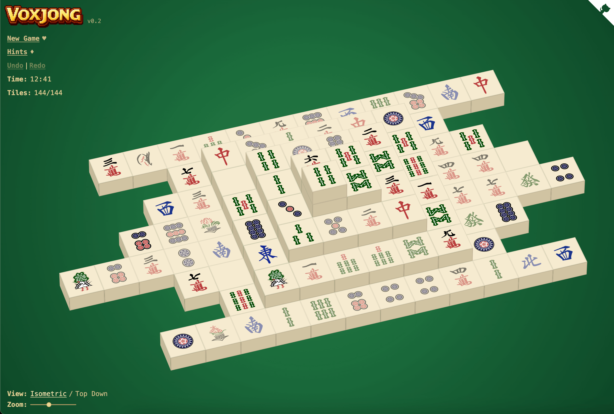

# VoxJong

VoxJong is a browser-based 3D CSS Mahjong Solitaire game that renders the board
as real HTML/CSS 3D geometry through [PolyCSS](https://github.com/LayoutitStudio/polycss),
without a WebGL or canvas renderer. The game generates a solvable turtle layout
in TypeScript, projects the active Mahjong tiles into textured CSS meshes, and
ships as a static Vite app.

Play the live version: [voxjong.com](https://voxjong.com)



## How to Play

Install dependencies and run the local dev server:

```sh
npm install
npm run dev
```

For production checks:

```sh
npm run check
npm run generate
npm run audit
```

`npm run check` runs the focused rule/render tests and a Vite production build.
`npm run generate` writes static output to the ignored `dist/` folder.

## How It Works

VoxJong uses PolyCSS for DOM-based 3D rendering. Each Mahjong tile becomes one
real DOM-backed mesh positioned in 3D with CSS transforms and textured with
the bundled tile PNGs, instead of being drawn into a canvas.

`src/game/mahjong.ts` owns the board model: turtle layout coordinates, solvable
deal generation, free-tile blocking checks, and Mahjong pair matching including
flower and season groups.

`src/composables/useMahjongSession.ts` owns the playable session state: active
tiles, selection, hints, timer, undo, redo, and new-game resets. `src/render`
then maps that game state into PolyCSS mesh data for the runtime in
`src/app.vue`.

## Build and Runtime

The browser does not fetch or generate tile art at runtime. Tile and logo
images are bundled from `src/assets/`, the social card is served from `public/`
for static metadata, and the assets are referenced by the generated Vite build.

VoxJong is designed as a static site. The generated Vite output is ignored by
Git, so the repository keeps source, tests, and bundled assets without checking
in build output.

## License

VoxJong source code is Copyright (C) 2026 Layoutit and licensed under
[GPL-3.0-or-later](LICENSE).

Mahjong tile images derived from
[FluffyStuff/riichi-mahjong-tiles](https://github.com/FluffyStuff/riichi-mahjong-tiles)
are in the public domain. Project-specific artwork is distributed under the
same project license unless noted otherwise. Runtime dependencies keep their
own licenses as declared in their package metadata.
